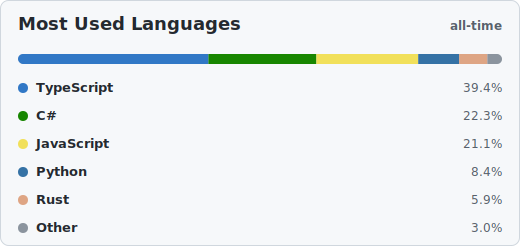
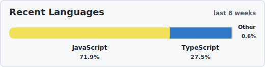

<h1>
  👋 Hi, I'm Simon
  
</h1>

I started building Software to solve Problems - What Solution do YOU need ?

## 🚀 Projects

### parkingpage-comingsoon

  
  
   
  
  
  

  A ready-to-customize coming soon page for launches, waitlists, 
  and early-access campaigns. It combines a glass-style content panel 
  with an animated WebGL background, draggable physics typography, 
  and an optional waitlist form powered by <code>VITE_FORM_ENDPOINT</code>.

[Quick setup](https://github.com/One-Simon/parkingpage-comingsoon#quick-setup) · [Customize](https://github.com/One-Simon/parkingpage-comingsoon#customize) · [Deploy](https://github.com/One-Simon/parkingpage-comingsoon#deploy-on-render)

 

---

### GitStats

  
  
   
  
  
  
  

  Fully configurable language breakdown cards for GitHub profile READMEs. 
  README-driven <code>gitstats:config</code> blocks generate managed SVG cards 
  for all-time language bytes or recent activity windows, 
  with normal and compact display styles.

[Quick setup](https://github.com/One-Simon/GitStats#quick-setup) · [Settings](https://github.com/One-Simon/GitStats#settings) · [Examples](https://github.com/One-Simon/GitStats#examples)

 

## 🧩 Languages

<!-- gitstats:config most-used
style: normal
grouping: false
max-languages: 4
hide-languages: HTML,CSS,JSON
timeframe: all-time
display-width: 70%
gitstats:config -->

<!-- gitstats:config recent
style: compact
grouping: true
hide-languages: HTML,CSS,JSON
timeframe: 8
display-width: 70%
gitstats:config -->

<!-- gitstats:display -->
  
   
   
  
<!-- gitstats:display -->

## Connect

  

