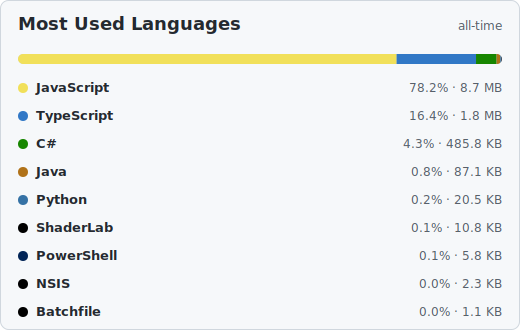
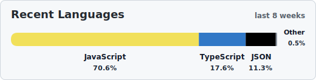

# 👋 Hi, I'm Simon

I started building Software to solve Problems - What Solution do YOU need ?

## Languages

<!-- gitstats:config most-used
title: Most Used Languages
subtitle: all-time
style: normal
timeframe: all-time
show-values: true
max-languages: 10
hide-languages: HTML,CSS
include-forks: false
include-archived: false
include-profile-repo: false
gitstats:config -->

<!-- gitstats:config recent
title: Recent Languages
subtitle: last 8 weeks
style: compact
timeframe: 8
show-values: true
max-languages: 10
hide-languages: HTML,CSS
include-forks: false
include-archived: false
include-profile-repo: false
gitstats:config -->

  
   
   
  

## Connect

